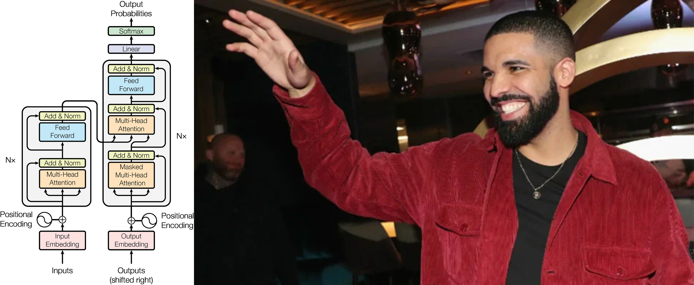
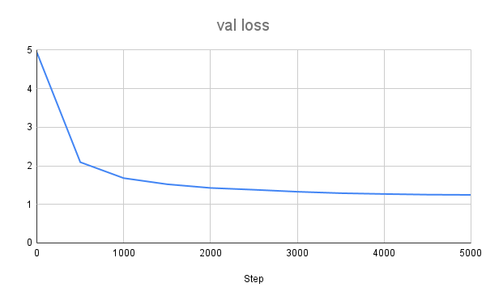

## DrakeGPT: A Transformer-based Text Generation Model



This project is an implementation of the transformer model as described in the paper "Attention is All You Need" by Vaswani et al. (2017). The model is trained on a dataset of 66,000 lines of lyrics from Drake (`training-data.txt`), and generates unique lyrics in the style of Drake. The data was downloaded from HuggingFace's huggingartists

### Model Details

The model is a decoder-only replication of the original 2017 transformer architecture however layer normalisation is done before the feed forward layer, also referred to as "Pre-Normalization" or "Pre-Layer Normalization". The model has 10,811,999 parameters and was trained on a single A100 GPU, taking approximately 30 minutes to complete the training process. Although a very small model, it functions decently well.

### Sample Generated Text

```
Niggas switchin out, they had us wishin out
Thats the signin out, they cant see me on this
And they wishin on me, I think more
And I be there and I be there is
The only time cant time if no things is bein me
I think Im gonna be there is me and Im playin out of my people
Suppose of the story, shes the only admired cause theres no same shit when them circling eagles flirt none and its comin me to me the basic
No tie to come fuck up, Im the next guesty not such and last night
Found some niggas, this year two of niggas, daddys voices
R.I.R.I.Aid Nigga. I got a fuckin plastic every mind. Nigga I can give em up Fronted
```

### Validation Loss during Training



### Running Locally

To run the model locally, follow these steps:

1. Download the trained model file (.pth) from this link: https://drive.google.com/file/d/1vGvn0WVMcWacc5HNGPs9JXvhqg4YmB9A/view?usp=sharing
2. Place the downloaded .pth file in the same directory as the Python scripts.
3. Run the use_model.py script to generate text, can modify output location and max sequence length (max_new_tokens)

### Main Files

1. `config.py`: Contains the hyperparameters for the model. Adjust as needed.

2. `model.py`: Defines the architecture of the GPT model.

3. `train_model.py`: Contains the code for training the model and saving to .pth file.

4. `use_model.py`: Code for loading the trained model and generating text to specified text file.

5. `utils.py`: Basic utility functions.

### References

Vaswani, A., Shazeer, N., Parmar, N., Uszkoreit, J., Jones, L., Gomez, A. N., ... & Polosukhin, I. (2017). Attention is all you need. In Advances in neural information processing systems (pp. 5998-6008).
